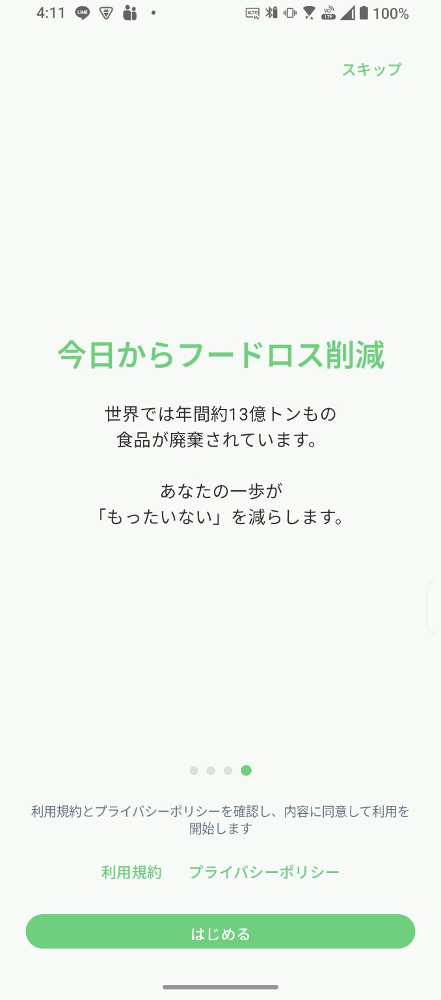
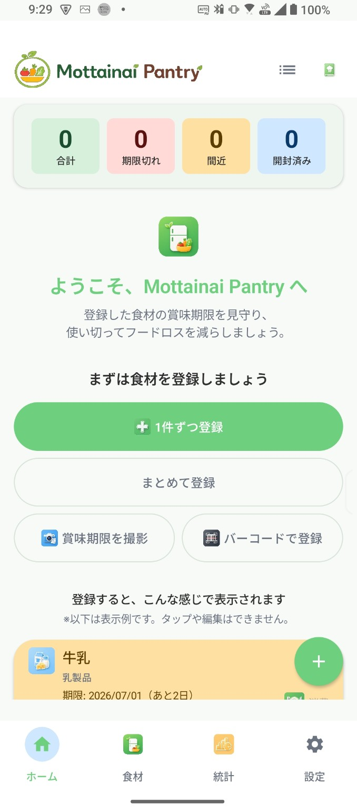

# Mottainai Pantry Web

  

Mottainai Pantry 縺ｮ蜈ｬ蠑集eb繧ｵ繧､繝医〒縺吶€・

螳ｶ蠎ｭ縺ｮ鬟溷刀繝ｭ繧ｹ繧呈ｸ帙ｉ縺吶◆繧√・ Android 繧｢繝励Μ縲勲ottainai Pantry縲阪・邏ｹ莉九€√・繝ｩ繧､繝舌す繝ｼ繝昴Μ繧ｷ繝ｼ縲∝茜逕ｨ隕冗ｴ・€√し繝昴・繝域ュ蝣ｱ繧呈軸霈峨＠縺ｾ縺吶€・

## Website

GitHub Pages:

https://mottainai-seeds.github.io/MottainaiPantry-Web/

## Pages

- [Home](index.html)
- [About](about.html)
- [CM](cm.html)
- [Download](download.html)
- [Privacy Policy](privacy.html)
- [Terms](terms.html)
- [Support](support.html)
- [FAQ](faq.html)
- [Changelog](changelog.html)

## Screenshots

| Onboarding | Home |
|---|---|
|  |  |

| AI Recipe | Statistics |
|---|---|
|  |  |

## Assets

- `images/app_logo.png`
- `images/app_icon.png`
- `images/screenshot01_onboarding.png`
- `images/screenshot02_home.png`
- `images/screenshot03_ai_recipe.png`
- `images/screenshot04_statistics.png`

## Status

迴ｾ蝨ｨ縺ｯ蜈ｬ髢句燕ﾎｱ繝・せ繝井ｸｭ縺ｧ縺吶€・

- Android迚医ｒ蜈郁｡碁幕逋ｺ荳ｭ
- iOS迚医・蟆・擂逧・↓讀懆ｨ惹ｺ亥ｮ・
- Google Play Billing縺ｯ譛ｪ螳溯｣・
- Supporter / Premium 縺ｯ莉雁ｾ悟ｯｾ蠢應ｺ亥ｮ・

## License

Personal Project
